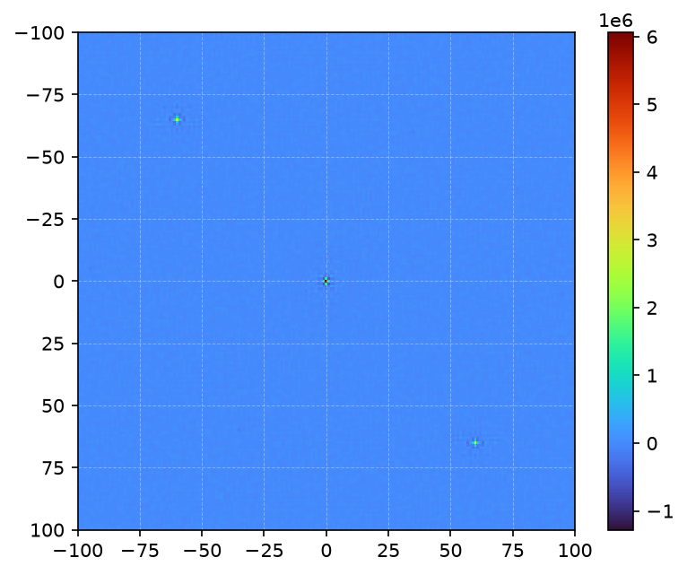
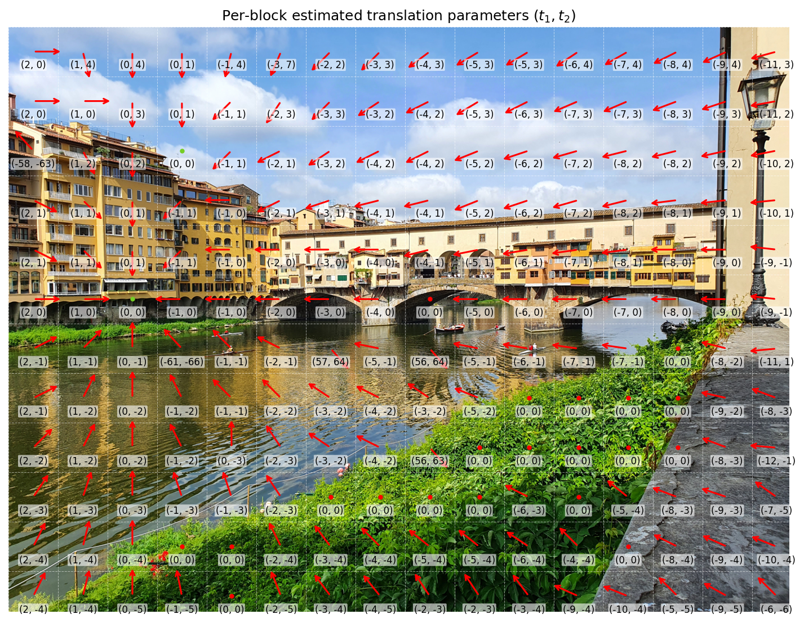

# Samsung NUAs
Official repository for the paper:

> D. Vázquez-Padín and F. Pérez-González, "Beyond Non-Unique Artifacts: SVD-Based PRNU Recovery for Samsung Device Identification," in ACM Workshop on Information Hiding and Multimedia Security (IH&MMSec '26), June 17–19, 2026, Firenze, Italy. ACM, New York, NY, USA,
12 pages. https://doi.org/10.1145/3785353.3815090

Paper available at:

https://dl.acm.org/doi/10.1145/3785353.3815090  


[](https://gpsc.uvigo.es/wp-content/uploads/2026/06/ihmmsec26_dvazquez_fperez.pdf)
[](https://ggl.link/Sl7fNQJ)

### Citation

If you use this repository in your research, please cite:

```
@ARTICLE{SAMSUNG_NUAS_2026,
  author={Vázquez-Padín, David and Pérez-González, Fernando},
  journal={ACM Workshop on Information Hiding and Multimedia Security (IH&MMSec '26)}, 
  title={Beyond Non-Unique Artifacts: SVD-Based PRNU Recovery for Samsung Device Identification}, 
  year={2026},
  doi={10.1145/3785353.3815090}}
```
---

# Overview

This repository provides the **reference Python implementation** and **characterization data** detailed in our study of Samsung NUAs (Non-Unique Artifacts).


**Key Resources Provided:**

- **NUA Patterns:** A dataset of 7 NUA patterns extracted from various Samsung devices (where Pattern 7 is a resized version of Pattern 6, denoted as $6^\dagger$).
- **Analysis Tools:** Python code encompassing:
  - Samsung NUAs autocorrelation mapping
  - SVD-based PRNU recovery algorithm
  - HDR-aware PRNU framework

Together, these resources facilitate the **reproduction of our experiments**, **evaluation of new image data**, and **analysis of Samsung NUA characteristics**.

***

*Implementation Note: Baseline PRNU-based source camera verification was executed using the Python port of the [Camera Fingerprint Program](https://dde.binghamton.edu/download/camera_fingerprint/).*

---

# Repository Structure
````
.
├── figs
│   ├── 01.svg
│   ├── 01_pattern_acorr_map.png
│   ├── 02.svg
│   ├── 03.svg
│   ├── 04.svg
│   ├── 05.svg
│   ├── 06.svg
│   ├── 06_dagger.svg
│   ├── quiver_plot.png
│   ├── Samsung_NUA_patterns_timeline.svg
├── LICENSE
├── README.md
├── requirements.txt
└── src
    └── SamsungNUAs_utils.py
````

---

# Samsung NUA patterns

The following **NUA patterns** were extracted from Samsung devices as described in the paper.

You can download individual patterns from the table below, or download the entire collection (including source images) as a ZIP archive [here](https://ggl.link/Sl7fNQJ).

|                           Pattern                            |  Resolution  |  Device   | Source Images                                                                     | Link                                 |
|:------------------------------------------------------------:|:------------:|:---------:|-----------------------------------------------------------------------------------|--------------------------------------|
|                  |  3024x4032   |    S10    | [D44 - Baracchi *et al.*, 2023](https://doi.org/10.1109/ACCESS.2023.3321991)      | [Download](https://ggl.link/UNpscLk) |
|                  |  3000x4000   |  vivoX60  | [D095 - Du *et al.*, 2025](https://doi.org/10.1109/ICASSP49660.2025.10890764)     | [Download](https://ggl.link/pRjB8h2) |
|                  |  3000x4000   |  A33 5G   | [A33 5G review](https://www.gsmarena.com/samsung_galaxy_a33_5g-review-2424p5.php) | Not publicly redistributable         |
|                  |  3468x4624   |  A53 5G   | Flickr references                                                                 | Not publicly redistributable         |
|                  |  3060x4080   |    A25    | [A25 review](https://www.gsmarena.com/samsung_galaxy_a25-review-2661p5.php)       | Not publicly redistributable         |
|                  |  3060x4080   |    A54    | [ZIP](https://ggl.link/zfC5ioV)                                                   | [Download](https://ggl.link/oNB9dV1) |
|  |  3000x4000   |    A56    | [ZIP](https://ggl.link/1h3DsFm)                                                   | [Download](https://ggl.link/owOItL2) |

**Notes:** 

- Flickr images and the corresponding NUA pattern for the A53 5G are not redistributed due to licensing restrictions, as the images used are marked as "All rights reserved." We will attempt to collect redistributable images and, once available, will also share the corresponding NUA pattern.
- Images collected from [GSMArena](https://www.gsmarena.com/) are not redistributed due to copyright and licensing restrictions. Researchers interested in these images should obtain them directly from the corresponding links to the original website, in accordance with its terms of use.

All patterns are stored as **MATLAB (`.mat`)** files.

Example of loading an NUA pattern in Python:

```python
from scipy.io import loadmat

data = loadmat("/path/to/01_pattern_S10.mat")
F = data["Fingerprint"]
````

---
# Samsung NUA Patterns Autocorrelation

Example usage:
> **Note:** You can modify the `min_val` parameter. The paper uses a value of `400`, but it is set to `100` here to make the peaks easier to spot.
```python
from src.SamsungNUAs_utils import plot_autocorrelation

fingerprint_path = "/path/to/01_pattern_S10.mat"
plot_autocorrelation(fingerprint_path, min_val=100)
```

Expected Output:



---

# SVD-based PRNU recovery algorithm

Below is the high-level pseudocode of the recovery process:

```text
INPUT: 
    F           : Original NUA-affected Fingerprint matrix
    block_shape : Dimensions of the processing blocks (bH, bW)
    r           : Number of dominant singular values to suppress

OUTPUT:
    PRNU        : Recovered PRNU fingerprint matrix

BEGIN
    Initialize PRNU matrix with NaN values
    Identify unique block anchors along the top and left edges (k=0 or l=0)

    FOR EACH anchor point DO
        // 1. Trace diagonal blocks and construct observation matrix B
        Find valid non-overlapping blocks along the diagonal, then flatten them into columns of matrix B
        
        // 2. Apply SVD
        Compute SVD of B: [U, s, Vt] = SVD(B)
        
        // 3. Remove NUAs subspace
        Set the first r singular values in s to 0
        
        // 4. Reconstruct cleaned observation matrix
        Compute B_clean = U * s * Vt
        
        // 5. Construct the recovered PRNU
        Reshape the columns of B_clean back into 2D blocks
        Insert blocks into their original positions in the PRNU matrix
    END FOR

    Replace any remaining NaN elements in PRNU with 0
    RETURN PRNU
END
```

Example usage:
```python
from src.SamsungNUAs_utils import recover_prnu_svd

fingerprint_path = "/path/to/01_pattern_S10.mat"
PRNU = recover_prnu_svd(fingerprint_path, block_shape = (65, 60), r=9, b_save=True, save_dir='/tmp/')
```

Expected Output:
```text
[info]: Saved recovered PRNU fingerprint to /tmp/01_pattern_S10_SVD_9.mat
```

---

# HDR-aware PRNU framework

This module demonstrates how to integrate the SVD-based PRNU recovery algorithm with the HDR-aware framework for PRNU-based source camera verification.

Example usage:
> **Note:** To ensure this example runs out of the box, we include a custom Python implementation of the wavelet-based denoising filter. You may observe minor numerical differences compared to the figures reported in the original paper; recall that the paper's experiments were conducted using a modified version of the Python port of the [Camera Fingerprint Program](https://dde.binghamton.edu/download/camera_fingerprint/).  
```python
import os
from src.SamsungNUAs_utils import recover_prnu_svd, HDR_aware_PRNU_verification

# ---- Parameters PRNU Recovery ----
fingerprint_path   = '/path/to/01_pattern_S10.mat'
block_shape        = (65, 60)
r                  = 9
b_save             = True
save_dir           = '/tmp'
b_verbose          = False

# ---- Run ----
PRNU = recover_prnu_svd(
    fingerprint_path   = fingerprint_path,
    block_shape        = block_shape,
    r                  = r,
    b_save             = b_save,
    save_dir           = save_dir,
    b_verbose          = b_verbose
)

# ---- Parameters HDR-aware framework ----
testImage_path   = '/path/to/D44_L1S6C2.jpg'
blockSize_HDR    = 256
b_plot_shifts    = True

HDR_aware_PRNU_verification(
    fingerprint_path   = fingerprint_path,
    PRNU_path          = os.path.join(save_dir,'01_pattern_S10_SVD_9.mat'),
    image_path         = testImage_path,
    block_size         = blockSize_HDR,
    plot_shifts        = b_plot_shifts
)
```

Expected Output:
```text
[info]: Saved recovered PRNU fingerprint to /tmp/01_pattern_S10_SVD_9.mat
[info]: PCE w/o HDR synchronization 12.47663610726296 vs. PCE w/ HDR synchronization 3992.03013708823 (reference: 01_pattern_S10_SVD_9).
```


---

# Requirements

Python ≥ 3.12

Required packages:
```
numpy
scipy
matplotlib
scikit-image
PyWavelets
pillow
```

Install:

```
pip install -r requirements.txt
```

---

# Image Dataset
The complete image dataset is **coming soon**. For early access or specific inquiries, please contact David Vázquez-Padín at: [dvazquez@gts.uvigo.es](mailto:dvazquez@gts.uvigo.es) 

---

# License

This project is licensed under the [Apache License 2.0](http://www.apache.org/licenses/LICENSE-2.0). See the `LICENSE` file for more details.

---

# Contact

For questions regarding the repository or the paper, please contact: David Vázquez-Padín ([dvazquez@gts.uvigo.es](mailto:dvazquez@gts.uvigo.es))